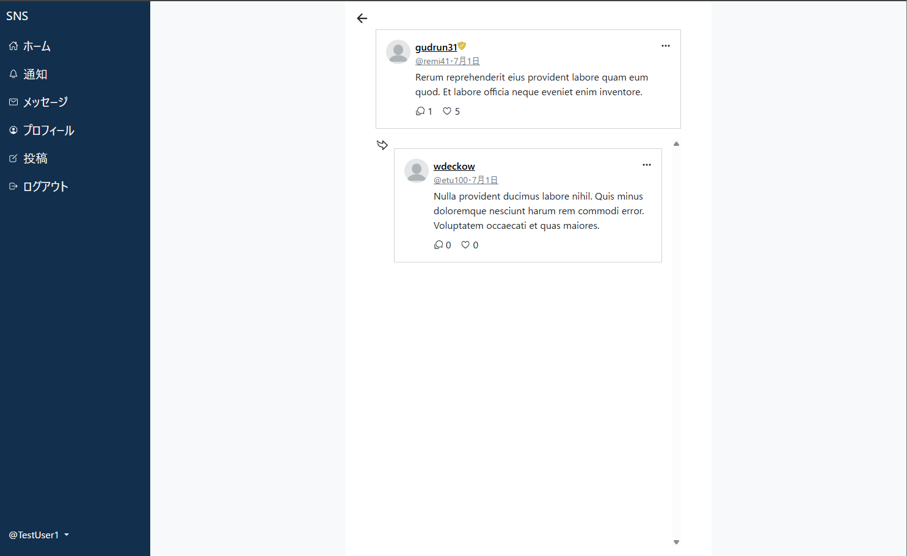

# Social-Networking-Service

## URL
https://sns.yua-tech.com

## アプリケーション概要

このアプリケーションはSNS(Social Networking Service)です。  
テキスト、画像の投稿、リアルタイムチャットやユーザー間のフォローなどの機能があります。  
このアプリケーションはWebアプリケーション開発の学習を目的として、作成しました。  
ここでのWebアプリケーション開発の学習とは、単に問題なく動作するWebアプリケーションを開発することではなく、  
Webアプリケーション開発における様々な要素をより深く理解することに重きを置いています。  
そのため、ライブラリやフレームワークは極力使用せず、独自のマイクロフレームワークを構築しています。

| 機能一覧 |
| ------------- |
| ユーザー登録 |
| ユーザーログイン |
| パスワードリセット |
| ユーザープロフィール設定 |
| 投稿 |
| 予約投稿 |
| リプライ |
| 投稿（リプライ）削除 |
| いいね |
| タイムライン（トレンド, フォロー） |
| リアルタイムチャット |
| 通知（フォロー, リプライ, いいね, チャットメッセージ受信） |

## 使用方法

### ログイン画面

### ユーザー登録・認証

登録時にはメールアドレス検証(制限時間付き)が必要です。

### パスワードリセット

パスワードを忘れた場合はリセットすることも可能です。

### タイムライン

タイムラインはトレンドとフォローをタブで切り替えることができます。  
トレンドはいいね数が多い順で表示します。  
フォローは自分とフォロワーの投稿を作成日順で表示します。

### 投稿

サイドメニューの「投稿」をクリックすると、ポスト作成用のモーダルが開きます。  
「予約する」をオンにし、日時を指定(YYYY/MM/DD HH:MM)することで、指定した時間に投稿することできます。  

### リプライ

投稿の左下のリプライアイコンをクリックすることで、リプライを作成することができます。  
リプライでは予約投稿はできません。

### 詳細

投稿をクリックすると、詳細画面に遷移し、当該投稿とそれ紐づくリプライを表示します。

### ユーザープロフィール

サイドメニューの「プロフィール」またはユーザーのアイコンやユーザー名をクリックすることで  
ユーザープロフィール画面に遷移します。  
プロフィール画面ではユーザー情報とそのユーザーの「投稿」「リプライ」「いいね」が表示されます

自分のプロフィール画面ではプロフィール編集ボタンが表示され、プロフィールを編集・更新することができます。  

フォローやフォロワーのリンクを押すとそれぞれの一覧が表示されます。  

### メッセージ

ユーザー同士でリアルタイムチャット(テキストのみ)を行えます。  
ユーザープロフィール画面にある✉アイコンからチャットページに遷移します。  

サイドメニューの「メッセージ」をクリックすると、すでにチャットを行っているユーザーの一覧が表示されます。

### 通知 

サイドメニューの通知をクリックすると、自分以外のユーザーからの
「いいね」「リプライ」「フォロー」「メッセージ」通知を確認することができます。  
通知をクリックすると、通知に対応する画面に遷移します。  
また、未確認の通知は背景色が水色になり、サイドメニューにも未確認の通知数が表示されます。  

### スマホ版

