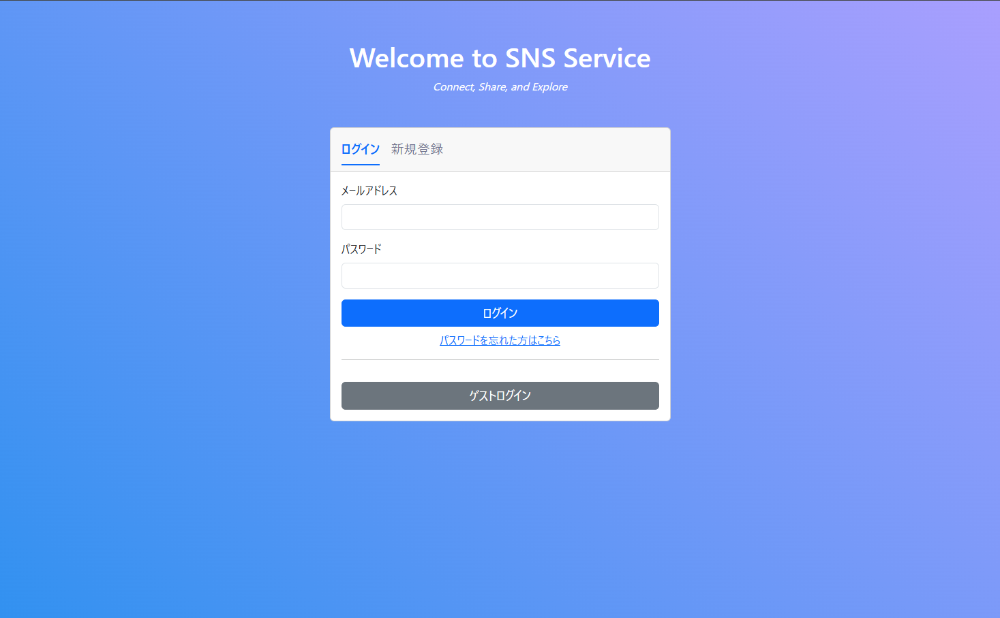

# Social-Networking-Service


## URL
https://sns.yua-tech.com


## アプリケーション概要

このアプリケーションはSNS(Social Networking Service)です。  
テキスト、画像の投稿、リアルタイムチャットやユーザー間のフォローなどの機能があります。  
このアプリケーションはWebアプリケーション開発の学習を目的として、作成しました。  
ここでのWebアプリケーション開発の学習とは、単に問題なく動作するWebアプリケーションを開発することではなく、  
Webアプリケーション開発における様々な要素をより深く理解することに重きを置いています。  
そのため、ライブラリやフレームワークは極力使用せず、独自のマイクロフレームワークを構築しています。

| 機能一覧 |
| ------------- |
| ユーザー登録 |
| ユーザーログイン |
| パスワードリセット |
| ユーザープロフィール設定 |
| 投稿 |
| 予約投稿 |
| リプライ |
| 投稿（リプライ）削除 |
| いいね |
| タイムライン（トレンド, フォロー） |
| リアルタイムチャット |
| 通知（フォロー, リプライ, いいね, チャットメッセージ受信） |

## 使用方法

### ログイン画面



### ユーザー登録・認証

登録時にはメールアドレス認証(制限時間付き)が必要です。


### パスワードリセット

パスワードを忘れた場合はリセットすることも可能です。


### タイムライン

タイムラインはトレンドとフォローをタブで切り替えることができます。  
トレンドはいいね数が多い順で表示します。  
フォローは自分とフォロワーの投稿を作成日順で表示します。


### 投稿

サイドメニューの「投稿」をクリックすると、ポスト作成用のモーダルが開きます。  
「予約する」をオンにし、日時を指定(YYYY/MM/DD HH:MM)することで、指定した時間に投稿することできます。  


### リプライ

投稿の左下のリプライアイコンをクリックすることで、リプライを作成することができます。  
リプライでは予約投稿はできません。


### 詳細

投稿をクリックすると、詳細画面に遷移し、当該投稿とそれ紐づくリプライを表示します。


### ユーザープロフィール

サイドメニューの「プロフィール」またはユーザーのアイコンやユーザー名をクリックすることで  
ユーザープロフィール画面に遷移します。  
プロフィール画面ではユーザー情報とそのユーザーの「投稿」「リプライ」「いいね」が表示されます


自分のプロフィール画面ではプロフィール編集ボタンが表示され、プロフィールを編集・更新することができます。  


フォローやフォロワーのリンクを押すとそれぞれの一覧が表示されます。  


### メッセージ

ユーザー同士でリアルタイムチャット(テキストのみ)を行えます。  
ユーザープロフィール画面にある✉アイコンからチャットページに遷移します。  


サイドメニューの「メッセージ」をクリックすると、すでにチャットを行っているユーザーの一覧が表示されます。


### 通知 

サイドメニューの通知をクリックすると、自分以外のユーザーからの  
「いいね」「リプライ」「フォロー」「メッセージ」通知を確認することができます。  
通知をクリックすると、通知に対応する画面に遷移します。  
また、未確認の通知は背景色が水色になり、サイドメニューにも未確認の通知数が表示されます。  


### スマホ版

<div>


</div>

## 開発

### ディレクトリ構造

```
Social-Networking-Service/
├ public // 公開されるファイル, index.php(エントリーポイント)
├ src // アプリケーションのソースコード
│ ├ Commands // コマンドプログラム関連
│ ├ Constants // 定数ファイル
│ ├ Database // データベース関連
│ ├ Exceptions // 例外
│ ├ Helpers // ヘルパークラスファイル
│ ├ Middleware // ミドルウェア関連
│ ├ Models // モデルオブジェクト関連
│ ├ Response // レスポンスオブジェクト関連
│ ├ Routing // 各種エンドポイントとその処理をまとめたルーティングファイル
│ ├ Types // データ型定義ファイル
│ ├ Views // viewファイル関連
│ └ WebSocket // WebSocket関連
├ ...
├ ...
...
```

### アプリケーションアーキテクチャ

このアプリケーションは、エントリーポイントである `public/index.html` が  
`src/Routing/routes.php` を用いて、アクセスに応じた処理を行います。  
また、各ページにアクセスはミドルウェアによって制限されています。  

データベースの管理にはマイグレーションベースを採用し、データベースアクセスにはDAOを利用しています。  
このアプリケーションはCSRを採用しているため、DAOを利用して取得したデータはJSONレスポンスとして返却されます。  

### インフラアーキテクチャ

インフラについてはシンプルで、AWSのEC2でアプリケーションを実行しています。  
データベースはMySQL、WebサーバーはNGINXを利用しています。  

ER図


### デプロイ

デプロイ処理はGitHub Actionsにより自動で実行されます。  
`main` ブランチが更新されると、GitHub Actionsによりデプロイ処理が実行されます。

### コマンドプログラム

コマンドを実行することで、マイグレーションファイルやシーディングファイルの作成、  
マイグレーションやシーディングの実行などができます。  

#### code-gen(マイグレーションファイルやシーディングファイルの作成)

`[file_type]` に `migration` もしくは `seeder` を指定することで、
指定した値に応じてマイグレーションファイル、シーディングファイルを作成します。
ファイルは以下のディレクトリに作成されます。  

- マイグレーションファイル
  - `src/Database/Migrations`
- シーディングファイル
  - `src/Database/Seeds`

`[file_name]` は任意のファイル名を指定することができます。

```
$ php console code-gen [file_type] --name [file_name]
```

#### migrate(マイグレーションの実行)

初回実行の際には `--init`（`-i`）オプションをつける必要があります。  
`--init` オプションは、マイグレーションを管理するためのテーブルをDBに作成します。  

マイグレーションは実行時のDBの状態とマイグレーションファイルの差分を確認し、  
未反映のマイグレーションファイルをファイル作成日順で実行します。

```
# 初回実行時
$ php console migrate --init

# 2回目以降実行時
$ php console migrate
```

ロールバック時は、`--rollback`（`-r`）オプションを使用します。  

```
$ php scripts/console migrate --rollback
```

また、ロールバックオプションに続けて整数値を設定すると、その回数分ロールバックを実行します。  
オプション値を設定しない場合は、1回分ロールバックが実行されます。

```
# 現在のバージョンから2回分ロールバックする
$ php scripts/console migrate -r 2
```

#### seed(シーディングの実行)

`src/Database/Seeds` に存在する全てのシーディングファイルが実行されます。

```
$ php console seed
```

#### scheduled-post(予約投稿)

予約投稿を実行するコマンドで、 cronジョブで定期実行しています。  

```
$ php console post-schedule-exec
```

## 工夫した点

- ミドルウェアによるアクセス制限
- 署名付きURLを利用した検証
- チャットメッセージの暗号化

#### ミドルウェアによるアクセス制限

各ページへのアクセスはミドルウェアによって制限されています。  
ほとんどのページはログインかつメール認証が必要なため、未ログインの場合は  
ログインページにリダイレクトされ、メール認証が済んでない場合は認証ページにリダイレクトされます。  

また、CSRF攻撃への対策として、CSRFトークンの生成とCSRFトークンの検証もミドルウェアで行っており、  
CRSFトークンが無効な場合はリクエストを拒否します。

#### 署名付きURLによる検証

ユーザーが入力したEメールが有効かどうか確認するために、アカウント作成する際に署名付きURLを作成し、  
入力されたEメールあてに送信します。ユーザーが受信した署名付きURLを開き、有効性を検証します。  

署名付きURLにはユーザーID、Eメール、有効期限を含め、HMAC SHA256を使用してURLを作成しています。    
署名が有効あることが確認されると、ユーザーのアカウント作成が成功し、ログインが可能になります。 

#### チャットメッセージの暗号化

すべてのチャットメッセージは、暗号化された状態でデータベースに保存され、読む際に復号されます。  
暗号化・復号化にはAES-256-CBCを使用しています。  

また、NGINXのリバースプロキシ機能を使いWSS化も行っております。

## 課題・改善点

- テストコードの追加
- 複数画像の投稿・動画の投稿
- 投稿の下書き
- 全体的なスタイルの整理